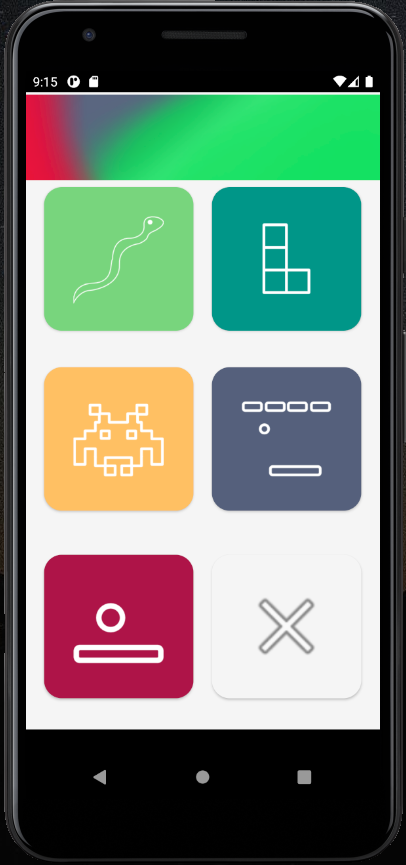
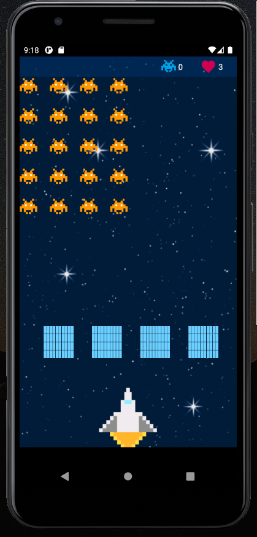
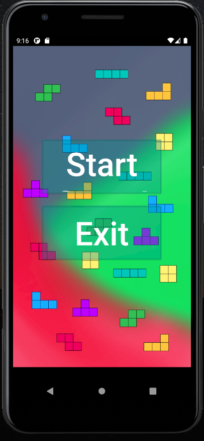
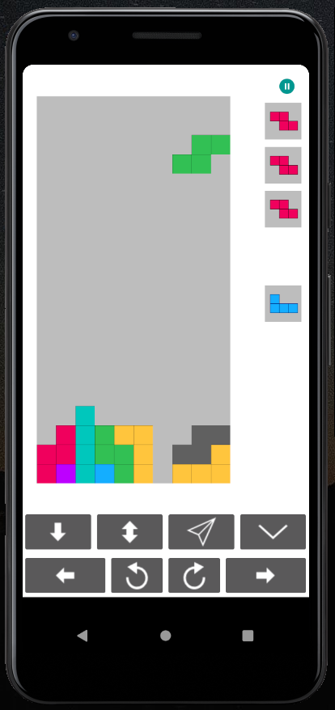

# Arcade game collection

## Content
- [Arcade game collection](#arcade-game-collection)
  - [Content](#content)
  - [About](#about)
  - [Games](#games)
    - [Start screen](#start-screen)
    - [Main menu](#main-menu)
    - [Snake](#snake)
    - [Breakout](#breakout)
    - [Pong](#pong)
    - [Space Invaders](#space-invaders)
    - [Tetris](#tetris)

## About
This mobile application contains 5 arcade games made in Android Studio.

## Games
* [Snake](https://github.com/sdumencic/forwardToThePast/wiki/Snake)
* [Space Invaders](https://github.com/sdumencic/forwardToThePast/wiki/Space-Invaders)
* [Tetris](https://github.com/sdumencic/forwardToThePast/wiki/Tetris)
* [Pong](https://github.com/sdumencic/forwardToThePast/wiki/Pong)
* [Breakout](https://github.com/sdumencic/forwardToThePast/wiki/Breakout)

### Start screen

### Main menu

### Snake

### Breakout

### Pong

### Space Invaders

### Tetris

